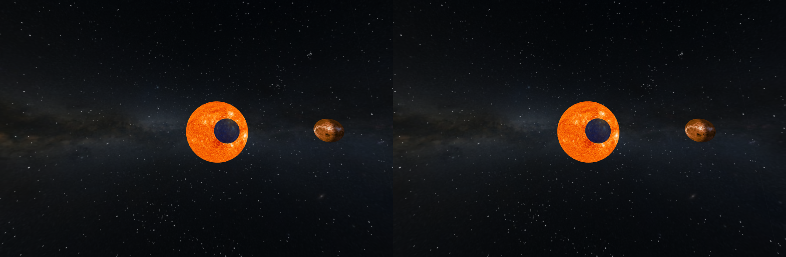

### WebVR solar system model using BabylonJS engine.

## Adapted from tutorial
- https://stackskills.com/courses/webgl-tutorial/lectures/397789

## Description
This app is an example of how to build a simple model using BabylonJS and WebVR. It is provided as a complement to the frequent use of the THREE.js engine. BabylonJS uses a different model (pre-built WebVR cameras) and should be easier to implement for beginners.

The current version has a few planets circling the Sun. Later versions will have more planets, along with more correct relative distances between the planets.

## Use

If WebVR is not present, the app defaults to the BabylonJS ArcRotate camera, which is entertaining on desktops. You can enable WebVR on devices that don't support it by adding in WebVR-Polyfill.

## Distances used from Sun (in final simulation)

| Planet   	| distance (AU) 	| revolution 	| eccentricity 	| inclination (deg) 	|
|----------	|---------------	|------------	|--------------	|-------------------	| 
| Sun      	|             0 	|    24.47 d 	|       -      	|                   	|
| Mercury  	|         0.387 	|   87.969 d 	|       0.2056 	|             7.005 	|
| Venus    	|         0.723 	|  224.701 d 	|       0.0068 	|            3.3947 	|
| Earth    	|         1.000 	|  365.256 d 	|       0.0167 	|             0.000 	|
| Mars     	|         1.524 	|   686.98 d 	|       0.0934 	|             1.851 	|
| Jupiter  	|         5.203 	|   11.862 y 	|       0.0484 	|             1.305 	|
| Saturn   	|         9.537 	|   29.457 y 	|       0.0542 	|             2.484 	|
| Uranus   	|        19.191 	|   84.011 y 	|       0.0472 	|             0.770 	|
| Neptune  	|        30.069 	|   164.79 y 	|       0.0086 	|             1.769 	|
| Planet 9 	|       ?       	|      ?     	|       ?      	|         ?         	|

| Planet   	| distance (AU) 	| revolution 	| eccentricity 	| inclination (deg) 	|
|----------	|---------------	|------------	|--------------	|-------------------	|
| Pluto    	| 39.482        	| 248.54 d   	| 0.2488       	| 17.16             	|
| Charon   	|               	|            	|              	|                   	|
| Ceres    	| 2.76          	| 4.559 y    	| 0.07976      	| 10.587            	|
| Eris     	| 67.67         	| 557 y      	| 0.44177      	| 44.187            	|
| Dysnomia 	|               	|            	|              	|                   	|
| Haumea   	| 43.33         	| 285.4 y    	| 0.18874      	| ?                 	|
| MakeMake 	| 45.80         	| 309.88 y   	| 0.44177      	|                   	|

## Resources

### Image sources
- http://home.arcor-online.de/axel.mellinger/licenses.html
- http://laps.noaa.gov/albers/sos/sos.html
- http://www.johnstonsarchive.net/spaceart/cylmaps.html
- http://www.solarsystemscope.com/textures/
- http://paulbourke.net/miscellaneous/starfield/

### Data 
 - http://nineplanets.org
 Dwarf planets in detail
 - http://web.gps.caltech.edu/~mbrown/dps.html

### BabylonJS CDN
- http://cdn.babylonjs.com/2-2/babylon.js
- http://cdn.babylonjs.com/2-2/babylon.max.js
- http://cdn.babylonjs.com/2-2/babylon.noworker.js

### BabylonJS Documentation
- [Documentation](http://doc.babylonjs.com)
- [Roadmap](http://doc.babylonjs.com/generals/Roadmap)
- [Samples](https://github.com/BabylonJS/Samples)
- [Video overview (1 hour) of BabylonJS features](http://www.youtube.com/watch?v=z80TYMqsdEM)
- [Complete course (8 hours)](http://www.microsoftvirtualacademy.com/training-courses/introduction-to-webgl-3d-with-html5-and-babylon-js)

### Useful links

 - [WebVR Info (latest on WebVR support)](http://webvr.info)
 - [WebVR Polyfill GitHub Site](https://github.com/googlevr/webvr-polyfill)

 - Official web site: [www.babylonjs.com](http://www.babylonjs.com/)

 - Official [forum](http://www.html5gamedevs.com/forum/16-babylonjs/) on www.html5gamedevs.com

 - Online [sandbox](http://www.babylonjs.com/sandbox) where you can test your .babylon scenes with a simple drag'n'drop

 - Online [shader creation tool](http://www.babylonjs.com/cyos/) where you can learn how to create GLSL shaders

 - 3DS Max [exporter](https://github.com/BabylonJS/Babylon.js/tree/master/Exporters/3ds%20Max) can be used to generate a .babylon file from 3DS Max

 - Blender [exporter](https://github.com/BabylonJS/Babylon.js/tree/master/Exporters/Blender) can be used to generate a .babylon file from Blender 3d

 - Unity 5 [exporter](https://github.com/BabylonJS/Babylon.js/tree/master/Exporters/Unity%205) can be used to export your geometries from Unity 5 scene editor

 - FBX command line [exporter](https://github.com/BabylonJS/Babylon.js/tree/master/Exporters/FBX) can be used to generate a .babylon file from .FBX file (animations are supported)

### Utility

 [Markdown Generator for Tables](http://www.tablesgenerator.com/markdown_tables#)

## Apache License 2.0 (Apache)

Apache License
Version 2.0, January 2004
http://www.apache.org/licenses/

=======
# webvr-planets-babylon
babylonjs planet simulation in WebVR
